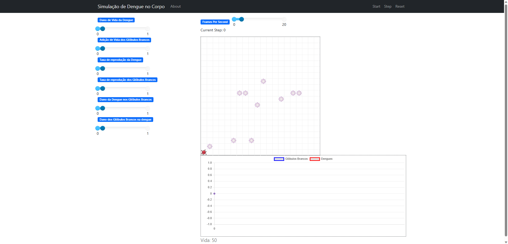
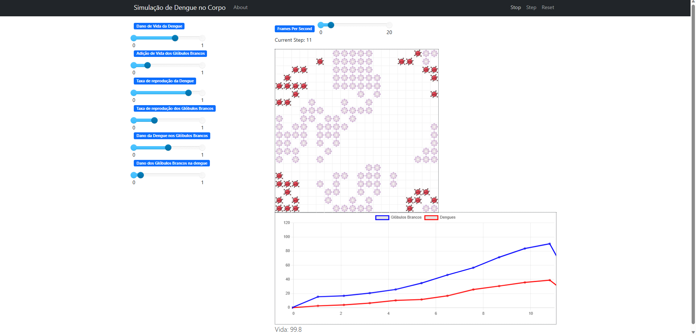

# Dengoso 

**Disciplina**: FGA0210 - PARADIGMAS DE PROGRAMAÇÃO - T02  
**Grupo**: 2 
**Paradigma**: SMA 

## Alunos
|Matrícula | Aluno |
| -- | -- |
| 180099353  |  Cibele Freitas Goudinho - @CibeleG |
| 190108011  |  Guilherme Brito Vilas Boas - @dev-brito |
| 170105342  |  Irwin Schmitt - @irwinschmitt |
| 180103792  |  Júlia Farias Sousa - @julisous |
| 180104390  |  Lameque Fernandes Azevedo - @LamequeFernandes |
| 201000379  |  Leonardo Milomes Vitoriano - @leonardomilv3 |
| 180078224  |  Thaís Rebouças de Araujo - @Thais-ra |
| 200028367  |  Victor Hugo Oliveira Leão - @victorleaoo |

## Sobre 
Este projeto tem como objetivo mostrar como a Dengue atua dentro do corpo humano e qual o grau de infecção em cada tipo de ambiente. Dessa forma, Foi utilizado o Paradigma Multiagentes em dois tipos de visualização, uma orientada a **reação do corpo humano ao vírus** e a outra **simulando os picos de infecção em ambientes controlados**. Para a criação dessas visualizações foi utilizado o framework em Python Mesa.

# Observação: ESTE PROGRAMA FOI CONSTRUÍDO APENAS PARA FINS EDUCATIVOS E NÃO REALIZA PREVISÕES REAIS!

## Screenshots

### Reação do corpo humano

### Contaminação

## Instalação 
**Linguagens**: Python 3.10 
**Tecnologias**: Mesa 1.2.1 

## Uso 

O projeto está dividido em duas pastas, em que cada uma tem suas instruções de instalação e uso:

- [Reação do Corpo Humano](https://github.com/UnBParadigmas2023-1-Turma02/2023.1_G2_SMA_SimuladorDoenca/tree/main/reacao_corpo_humano)
- [Contaminação](https://github.com/UnBParadigmas2023-1-Turma02/2023.1_G2_SMA_SimuladorDoenca/tree/main/simulacao_dengue)
  

## Vídeo
Link para o vídeo de apresentação dos dois projetos: https://youtu.be/zXkaoay7Sf4
## Participações
Apresente, brevemente, como cada membro do grupo contribuiu para o projeto.
|Nome do Membro | Contribuição | Significância da Contribuição para o Projeto (Excelente/Boa/Regular/Ruim/Nula) |
| -- | -- | -- |
| Cibele  |  Programação da interação entre agentes Dengue x Glóbulos Brancos | Excelente |
| Victor  |  Estruturação da reação do corpo humano com o MESA. Modularização e comentários nos códigos da reação do corpo humano. | Excelente |
|Guilherme | Configuração do servidor e interface do MESA e implementações pontuais nos modelos e agentes da simulação de contaminação. | Excelente |
|Leonardo Vitoriano| Programação do Agente Mosquito e interação com Agente Pessoa. Desenvolvimento da Model responsável por criar os 2 Agentes | Excelente |
|Júlia Farias| Implementação dos gráficos do comportamento da simulação de contaminação | Excelente |
| Irwin Schmitt | Estilização da reação do corpo humano. | Regular |
| Lameque Fernandes | Implementação do agente Pessoa da simulação de contaminação, github pages e contribuição na model. | Boa |

## Outros 

(i) Lições Aprendidas:

> Guilherme: Gostei bastante desse paradigma e especificamente da biblioteca do MESA, pois me abriu os olhos para diversas simulações que podem ser feitas utilizando dessa biblioteca, como simulações de epidemias, interações sociais e ambientais. Além de poder aperfeiçoar na linguagem Python, que não é uma linguagem que sou muito adepto(Java é melhor, ja ganhou meu coração, mas aqui até que eu gostei de você python, fica triste não).

> Júlia: Gostei muito do paradigma, senti a curva de aprendizado mais rápida e a possibilidade de dividir em dois trabalhos fez com que sentisse que todos estavam fazendo partes importantes do trabalho e que pudessemos trabalhar em conjunto ao mesmo tempo.

> Victor: Achei interessante como podemos ver diferentes agentes interagindo com o modelo como um todo, mas, também, com outros agentes, o que me leva a pensar em muitas diferentes utilidades que esse paradigma pode ter e trazer.
    
(ii) Percepções:

> Victor: Percebi que a curva de aprendizado com o framework MESA é muito rápida com a documentação e os diferentes exemplos propostos. Além disso, acredito que por esse paradigma poder ser desenvolvido em linguagens mais "usuais" para os membros do grupo, todos se sentiram confortáveis em trabalhar.

> Lameque: Amei o paradigma. Acredito que gostei mais do que eu esperava por termos usado python e o framework mesa, que facilitou muito na realização do projeto e no entendimento do paradigma.

(iii) Contribuições e Fragilidades:

(iV) Trabalhos Futuros:

- Adequação de taxas de morte, contaminação para uma simulação mais real.
- Para a parte de reação do corpo humano, poderia ter um estudo mais aprofundado de como o vírus da dengue e o corpo trabalham nas diferentes situações, a fim de ter um projeto mais fidedigno à realidade.
- Adição de um gráfico que trate das mortes.Mostrando total de mortos, quantos morreram na primeira infecção, quantos morreram na segunda infecção e quantos morreram na terceira infecção.

## Fontes
 - https://www.saude.df.gov.br/documents/37101/554390/11_BOLETIM_MENSAL_ARBOVIROSES-2022_SE_01_a_11.pdf 
 - https://www.saude.df.gov.br/informes-dengue-chikungunya-zika-febre-amarela
 - https://noticias.unb.br/125-saude/5742-especialista-da-unb-analisa-aumento-de-casos-de-dengue-no-distrito-federal
