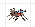
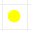
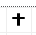
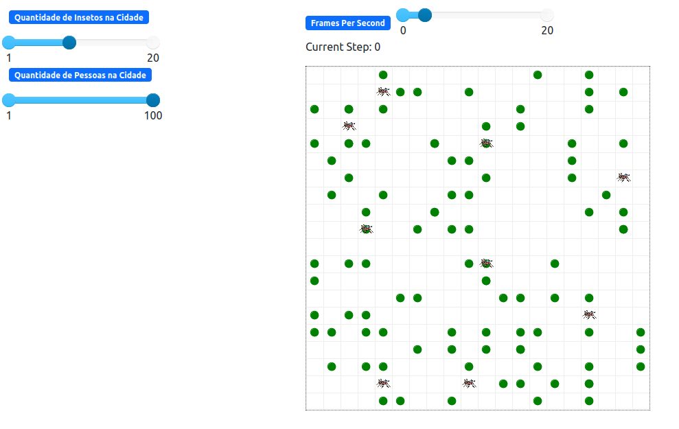

# Dengoso - Reação do Corpo Humano

## Alunos que trabalharam nesse contexto do trabalho

| Matrícula | Aluno                                         |
| --------- | --------------------------------------------- |
| 190108011 | Guilherme Brito Vilas Boas - @dev-brito       |
| 180104390 | Lameque Fernandes Azevedo - @LamequeFernandes |
| 201000379 | Leonardo Milomes Vitoriano - @leonardomilv3   |
| 180103792 | Júlia Farias Sousa - @julisous                |

## Sobre 

Essa parte do projeto visa mostrar como seria a contaminação de uma população em relação ao vírus (no caso, o da Dengue). Então, para isso, foram feitos dois tipos de agentes: **Mosquito (vetor da doença)** e **Pessoa**. Eles possuem atributos que permitem a execução de uma simulação interativa e lúdica que mostra o esquema de infecção, reinfecção, morte e cura dos habitantes.

Para fins de representação dos agentes, foram utilizados os seguintes símbolos:

|                   Símbolo                   |           Significado            |
| :-----------------------------------------: | :------------------------------: |
|                     |             Mosquito             |
|                       | Pessoa que foi infectada 0 vezes |
|          |  Pessoa que foi infectada 1 vez  |
|          | Pessoa que foi infectada 2 vezes |
|          | Pessoa que foi infectada 3 vezes |
|                 |           Pessoa morta           |
|  |   Pessoa infectada no momento    |

# Observação: ESTE PROGRAMA FOI CONTRUÍDO APENAS PARA FINS EDUCATIVOS E NÃO REALIZA PREVISÕES REAIS!

## Instalação

**Linguagens**: Python 3.10.6<br>
**Tecnologias**: Mesa 1.2.1<br>

Instale as dependências com o comando: ```pip install -r requirements.txt```.

## Uso

Afim de usar o projeto, rode o seguinte comando para inicializar o mesa: ```mesa runserver```.

Abra a url [http://127.0.0.1:8521/]( http://127.0.0.1:8521/) para ter acesso ao projeto.

Assim, na lateral esquerda é possível alterar os parâmetros desejados para a realização da simulação. No menu superior, na parte mais à direita, é possível apertar 'Start' para iniciar, 'Stop' para parar e 'Reset' para começar novamente a execução.




